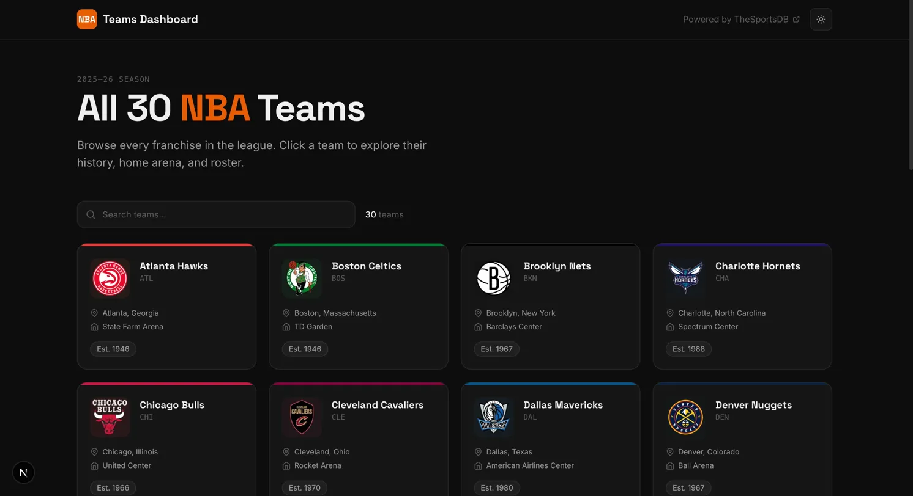
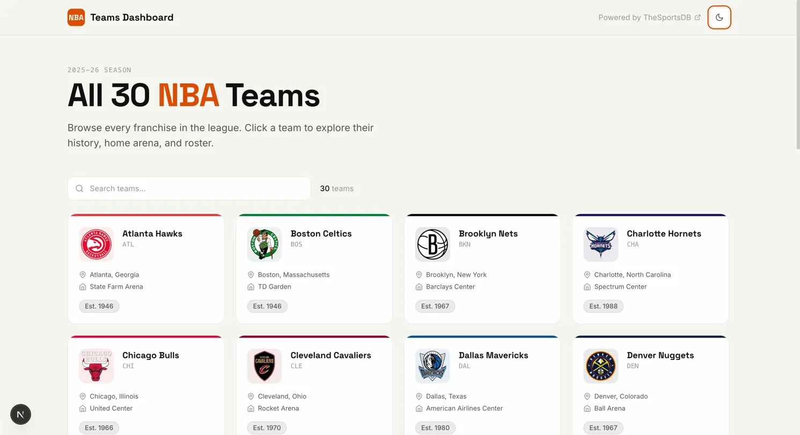
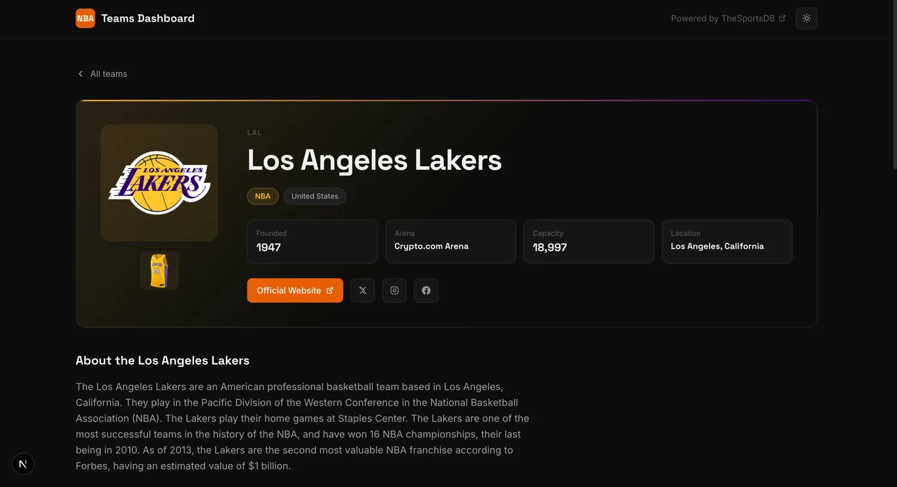
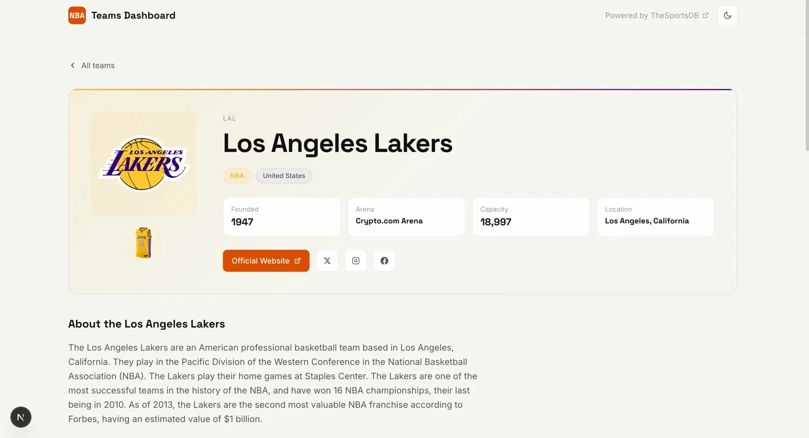

# NBA Teams Dashboard

A responsive data dashboard showcasing all 30 NBA franchises — built as a front-end take-home project in Next.js 16 with a focus on aesthetic polish, accessibility, and thoughtful architecture.

**Live demo:** [nba-teams-dashboard.vercel.app](https://nba-teams-dashboard.vercel.app)


---

| Dark | Light |
|---|---|
|  |  |
|  |  |

---

## Highlights

- **Editorial visual design** — per-team accent colors pulled from the API, Space Grotesk display type, and a dark mode that's the default (not an afterthought)
- **Zero-flash theme toggle** — a blocking inline script sets the theme before first paint, so reloading never shows a white flash in dark mode
- **Real React 19 concurrent features** — search uses `useDeferredValue` so typing never blocks rendering, even on a throttled CPU
- **Server Components by default** — data fetching lives in `async` server components, client components only where interactivity demands them

## Features

- All 30 NBA teams in a responsive grid (1 → 2 → 3 → 4 columns across breakpoints)
- Live client-side search by name, city, or abbreviation
- Dedicated team detail pages with badge, arena, capacity, founding year, description, and roster
- Skeleton loading, empty, and error states at both the list and detail levels
- Error boundaries with a working "Try again" button that refetches
- Dark / light mode toggle persisted to `localStorage`, respects `prefers-color-scheme` on first visit
- Staggered card reveal animations and hover-lift via Framer Motion
- Fully keyboard navigable with visible focus rings, ARIA live regions on search, and semantic landmarks
- Responsive from 375px up, tested across mobile, tablet, and desktop breakpoints

## Quick start

Requires Node.js 20 or higher.

```bash
git clone https://github.com/akallam04/nba-dashboard.git
cd nba-dashboard
npm install
npm run dev
```

Open [http://localhost:3000](http://localhost:3000). No environment variables or API keys required — the project uses [TheSportsDB](https://www.thesportsdb.com/)'s free public tier.

For a production build:

```bash
npm run build
npm start
```

## Architecture

### Why App Router over Pages Router

The App Router (stable since Next.js 13.4) co-locates data fetching with the components that consume it via async Server Components. That eliminates the prop-drilling and loading-waterfall problems inherent to `getServerSideProps`. Each route segment owns its own `loading.tsx` and `error.tsx`, which Next wraps in `<Suspense>` and `<ErrorBoundary>` automatically — so route-level loading and error UI cost almost no code.

### Server vs. Client Components

| Component | Rendering | Why |
|---|---|---|
| `app/page.tsx` | Server | Fetches all 30 teams at request time, no client JS needed for initial render |
| `app/teams/[id]/page.tsx` | Server | Parallel fetch of team + roster, zero client-side waterfall |
| `TeamGrid` | Client | Owns search state, needs `useState` and `useDeferredValue` |
| `TeamCard` | Client | Framer Motion animations require browser APIs |
| `ThemeToggle` | Client | Reads and writes `localStorage`, mutates the DOM |

The API layer in `src/lib/api.ts` uses `fetch` with `next: { revalidate: 3600 }`, giving free server-side caching without any manual cache plumbing.

### State management

Deliberately minimal — no Redux, no Zustand, no Context. The only state in the app is:

1. Search query (`useState` inside `TeamGrid`, filtered with `useDeferredValue`)
2. Theme preference (`localStorage` plus a `data-theme` attribute on the `<html>` element)

Adding a favorites feature would be the natural trigger for introducing persisted local state, and a team comparison view would justify a lightweight store.

### Zero-flash theme toggle

The standard pitfall with dark mode is the brief white flash on page load before JavaScript runs and applies the user's saved preference. The fix is a blocking synchronous `<script>` in `<head>` that runs before paint — it reads `localStorage`, falls back to `prefers-color-scheme`, and sets `data-theme` on `<html>` before any styles apply. CSS custom properties keyed on `[data-theme]` handle the actual color switching from there, so navigation never re-flashes.

### Error boundaries

Three error entry points are wired up:

- `app/error.tsx` catches list page fetch failures
- `app/teams/[id]/error.tsx` catches detail page fetch failures
- `app/teams/[id]/not-found.tsx` renders when `notFound()` is thrown for an invalid team id

## Project structure

```
src/
├── app/
│   ├── layout.tsx              # Root layout: fonts, theme script, header
│   ├── page.tsx                # List page (Server Component)
│   ├── loading.tsx             # Route-level skeleton
│   ├── error.tsx               # Route-level error boundary
│   ├── globals.css             # Tailwind + theme CSS variables
│   └── teams/[id]/
│       ├── page.tsx            # Detail page (Server Component)
│       ├── loading.tsx
│       └── error.tsx
├── components/
│   ├── Button.tsx              # Reusable — variants + sizes
│   ├── LoadingIndicator.tsx    # Spinner + skeleton variants
│   ├── TeamCard.tsx            # Per-team accent color + motion
│   ├── TeamGrid.tsx            # Client: search state + filtered render
│   ├── PlayerCard.tsx
│   ├── SearchInput.tsx         # Controlled input + ARIA live region
│   ├── EmptyState.tsx
│   ├── ErrorState.tsx
│   ├── ThemeToggle.tsx
│   └── Header.tsx
├── lib/
│   ├── api.ts                  # Typed fetch wrappers
│   └── utils.ts                # cn() + color/URL helpers
└── types/
    └── index.ts                # Team, Player, API response types
```

## Known limitations

- **Roster depth is limited to ~10 players per team** — this is a hard cap on TheSportsDB's free public tier (`lookup_all_players.php`), not a UI bug. The detail page labels this section "Featured Players" and notes the limitation. A premium API key would return full rosters.
- **No automated tests** — unit and E2E tests were out of scope for the time budget. See the roadmap below.
- **Time-based revalidation only** — the 1-hour `revalidate` window means data can be up to an hour stale. On-demand revalidation via webhooks would be the right production approach.
- **No pagination** — not needed for 30 items, but would be essential at league-wide player scale.

## Roadmap

Things I'd tackle next with more time:

- Unit tests with Vitest + React Testing Library, targeting `TeamGrid` search logic and the theme toggle's localStorage handling
- End-to-end tests with Playwright for the list → search → detail → back flow
- Favorites feature persisted to localStorage, with starred teams pinned to the top of the grid
- Team comparison view for side-by-side stats
- Conference / division filter chips alongside search
- Dynamic OG images per team via `opengraph-image.tsx`
- GitHub Actions CI: lint + typecheck + build on every PR
- Full WCAG 2.1 AA audit with axe-core
- Lighthouse 90+ across Performance, Accessibility, Best Practices, and SEO

## License

MIT
